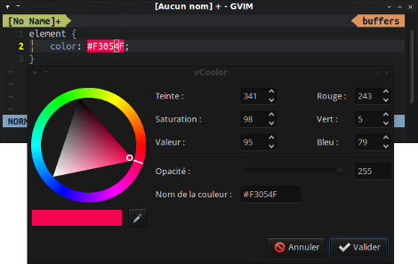
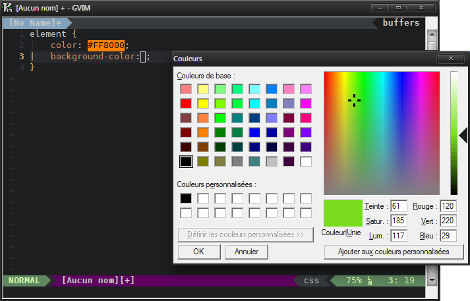
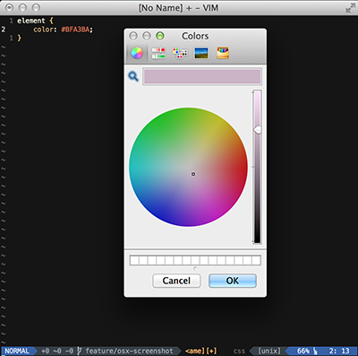

vCoolor - Simple color selector/picker plugin for Vim.
======================================================

Description
-----------

vCoolor is a Vim plugin that allows using a color picker/selector directly from the editor.

What this plugin do:

* Insert hex, rgb, rgba (With 1 in opacity) or hsl color anywhere.
* Modify hex color even if there are many colors in 1 line.
* Modify a rgb color with 0-255 values or % (Only one by line).
* Modify a rgba color but don't change the opacity (Only one by line).
* Modify a hsl color (Only one by line).

What this plugin doesn't do:

* Insert or modify hsla colors.

In GNU/Linux it uses a simple GTK+ dialog via [Zenity](https://wiki.gnome.org/action/show/Projects/Zenity) or [Yad](http://sourceforge.net/projects/yad-dialog/).

In windows it uses [colorpicker-windows-commandline](https://github.com/jaxbot/colorpicker-windows-commandline) (The binary is included in the plugin).

In Mac OSX it uses a [ruby script](https://github.com/KabbAmine/vCoolor.vim/tree/master/osx/color-picker) to trigger the system color picker.

Installation
-------------

To use vCoolor in GNU/Linux, you need to have [Zenity](https://wiki.gnome.org/action/show/Projects/Zenity) (Included in most distributions) or [Yad](http://sourceforge.net/projects/yad-dialog/) (If you compile it manually, do it with GTK2 to avoid problem [#1](https://github.com/KabbAmine/vCoolor.vim/issues/1)).

### Manual installation

Install the distributed files into Vim runtime directory which is usually `~/.vim/`, or `$HOME/vimfiles` on Windows.

### Using Pathogen
If you're using pathogen, extract the files into `bundle` directory.

### Using Vundle (Best way)
Just add the following line in the Vundle part of your vimrc:
	
	Plugin 'KabbAmine/vCoolor.vim'

Then proceed to the installation of the plugin with the following command:

	:PluginInstall

Usage
-----

In both NORMAL and INSERT modes, only 1 shortcut is needed: `<Alt-C>` (I find it very convenient :D), but he may be not working on terminal.

Use it:

* To insert a color anywhere.
* To modify the current hex, rgb, rgba or hsl color.

And using:

* `<Alt-R>` you can insert a rgb color anywhere (NORMAL and INSERT modes).
* `<Alt-V>` you can insert a hsl color anywhere (NORMAL and INSERT modes).
* `<Alt-W>` you can insert a rgba color anywhere (NORMAL and INSERT modes).

Click on the image for a short screencast of the v0.1.

Commands
--------

You can execute vCoolor with:

	:VCoolor
	:VCoolIns r		" For rgb color insertion
	:VCoolIns h		" For hsl color insertion
	:VCoolIns ra	" For rgba color insertion

You can toggle between lower/upper case for the returned hex color with:

	:VCase

Also, I've used some color conversion commands for debug purpose but I finally decided to keep them in the plugin, they may be useful.

Here they are with exemples to understand how they work:

	:Rgb2Hex "255, 0, 255"			" Gives "#FF00FF"
	:Rgb2RgbPerc "255, 0, 255"		" Gives "100%, 0%, 100%"
	:Rgb2Hsl "255, 0, 255"			" Gives "300, 100%, 50%"

	:RgbPerc2Hex "100%, 0%, 100%" " Gives "#FF00FF"
	:RgbPerc2Rgb "100%, 0%, 100%" " Gives "255, 0, 255"

	:Hex2Lit "#FF00FF"				" Gives "magenta"
	:Hex2Rgb "#FF00FF"				" Gives "255, 0, 255"
	:Hex2RgbPerc "#FF00FF"			" Gives "100%, 0%, 100%"
	:Hex2Hsl "#FF00FF"				" Gives "300, 100%, 50%"

	:Hsl2Rgb "300, 100%, 50%"		" Gives "255, 0, 255"
	:Hsl2Hex "300, 100%, 50%"		" Gives "#FF00FF"

Mapping
-------

To change the mapping by default, add to your *vimrc*.

	let g:vcoolor_map = '<NEW_MAPPING>'
	let g:vcool_ins_rgb_map = '<NEW_MAPPING>'		" Insert rgb color.
	let g:vcool_ins_hsl_map = '<NEW_MAPPING>'		" Insert hsl color.
	let g:vcool_ins_rgba_map = '<NEW_MAPPING>'		" Insert rgba color.

Each mapping works in both `NORMAL` and `INSERT` mode (You can disable all of them, see Customization part for tha).

Customization
-------------

To disable all default mappings and map only what you want, add to your *vimrc*:

	let g:vcoolor_disable_mappings = 1

To get hex colors in lower case by default:

	let g:vcoolor_lowercase = 1

TODO
----

- A better regex patterns.
- Handle ~~rgba~~ and hsla colors.
- Add possibility to modify 2 or more rgb colors in a line.

Thanks
-------

To Yad's author.

To Bram Moolenaar for creating the best piece of software in the world :D

To Jonathan Warner alias [jaxbot](https://github.com/jaxbot) for his contribution.

To you if you're using vCoolor.
